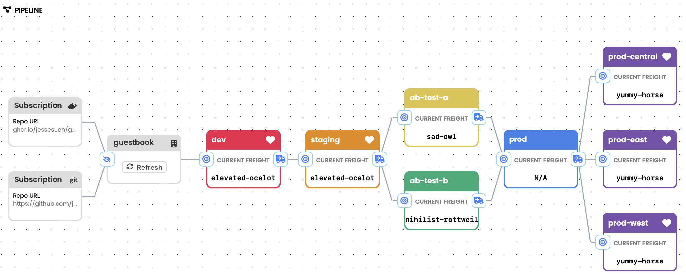

# Kargo Simple Example

This is a GitOps repository of a simple Kargo example for getting started.

### Features:
* A Warehouse which monitors a container repository for new images
* Three Stage (dev, staging, prod) deploy pipeline
* Image tag promotion
* Direct git commits to dev, staging
* Pull request for promotion to prod

This example does not require an Argo CD instance and so would work with any GitOps operator (Argo CD, Flux) that detects and deploys manifest changes from a path in a git repo automatically (e.g. using auto-sync).


## Instructions

1. Fork this repo, then clone it locally (from your fork).
2. Run the `personalize.sh` to customize the manifests to use your GitHub username.
```
./personalize.sh <yourgithubusername>
```
3. `git commit` the personalized changes
```
git commit -a -m "personalize manifests"
git push
```
4. Create a guestbook container image repository in your GitHub account. 

The easiest way to create a new ghcr.io image repository, is by retagging/pushing an existing image with your github username:

```
docker buildx imagetools create \
    ghcr.io/akuity/guestbook:latest \
    -t ghcr.io/<yourgithubusername>/guestbook:v0.0.1
```

You will now have a `guestbook` container image repository. e.g.:

https://github.com/yourgithubusername/guestbook/pkgs/container/guestbook

5. Change guestbook container image repository to public.

In the GitHub UI, navigate to the "guestbook" container repository, Package settings, and change the visibility of the package to public. This will allow Kargo to monitor this repository for new images, without requiring you to configuring Kargo with container image repository credentials.


6. Download and install the latest CLI from [Kargo Releases](https://github.com/akuity/kargo/releases)

```
./download-cli.sh /usr/local/bin/kargo
```

7. Login to kargo

```
kargo login https://<kargo-url> --admin
```

8. Add git repository credentials to Kargo.

```
$ ./add-credential.sh
Configuring credentials for https://github.com/akuity/kargo-simple.git
Username: yourgithubusername
Password: <github PAT>
```

As part of the promotion process, Kargo requires privileges to commit changes to your git repository, as well as the ability to create pull requests. Ensure that the given token has these privileges.


9. Apply the Kargo manifests

```
kargo apply -f ./kargo
```

10. Promtote the image!

You are now configured a Warehouse monitoring your guestbook container image repository, and a three-stage deploy pipeline

Visit the `kargo-simple` Project in the Kargo UI to see the deploy pipeline.



To promote, click the target icon to the left of the `dev` Stage, select the detected Freight, and click `Yes` to promote. Once promoted, the freight will be qualified to be promoted to downstream Stages (`staging`, `prod`).


## Simulating a release

To simulate a release, simply retag an image with a newer semantic version. e.g.:

```
docker buildx imagetools create \
    ghcr.io/akuity/guestbook:latest \
    -t ghcr.io/<yourgithubusername>/guestbook:v0.0.2
```

Then refresh the Warehouse in the UI to detect the new Freight.
