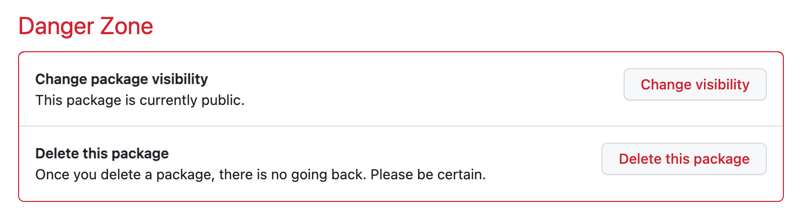

# Kargo Simple Example

This is an example GitOps repository for simple Kargo example for getting started.

### Features:
* A Warehouse which monitors a container repository for new images
* Three Stages (dev, staging, prod)

It does not require an Argo CD instance and so would work with any GitOps operator (Argo CD, Flux) that detects and deploys manifest changes from a path in a git repo automatically (e.g. using auto-sync).


## Instructions

1. Fork this repo, then clone it locally (from your fork).
2. Run the `personalize.sh` to customize the manifests to use your GitHub username.
```
./personalize.sh <yourgithubusername>
```
3. `git commit` the personalized changes
```
git commit -a -m "personalize manifests"
```
4. Create a guestbook container repository in your GitHub account. The easiest way to create a new ghcr.io repository, is by retagging/pushing an existing image with your github username:

```
docker buildx imagetools create \
    ghcr.io/akuity/guestbook:latest \
    -t ghcr.io/<yourgithubusername>/guestbook:v0.0.1
```

5. You will now have a `guestbook` container repository. Navigate to the "guestbook" container repository and change the visibility of the package to public. This will allow Kargo to monitor this repository for new images, without configuring credentials.



6. Download the latest CLI from [Kargo Releases](https://github.com/akuity/kargo/releases)
7. Login to kargo

```
kargo login https://<kargo-url> --admin
```

8. Apply the Kargo manifests

```
kargo apply -f ./kargo
```

9. Add a GitHub PAT to Kargo. In these examples, the PAT must be able to write to your git repository, as well as open pull requests, as part of promotion.
Modify the `username` and `password`  fields of `github-creds.yaml`. Then apply the Secret. 

```
# edit github-creds.yaml
kargo apply -f ./github-creds.yaml
```

## Simulating a release

To simulate a release, simply retag an image with a newer semantic version. e.g.:

```
docker buildx imagetools create \
    ghcr.io/akuity/guestbook:latest \
    -t ghcr.io/<yourgithubusername>/guestbook:v0.0.2
```

Then refresh the Warehouse in the UI to detect the new Freight.
